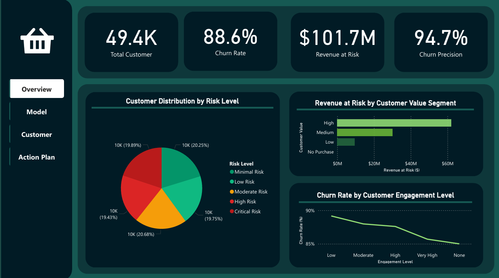
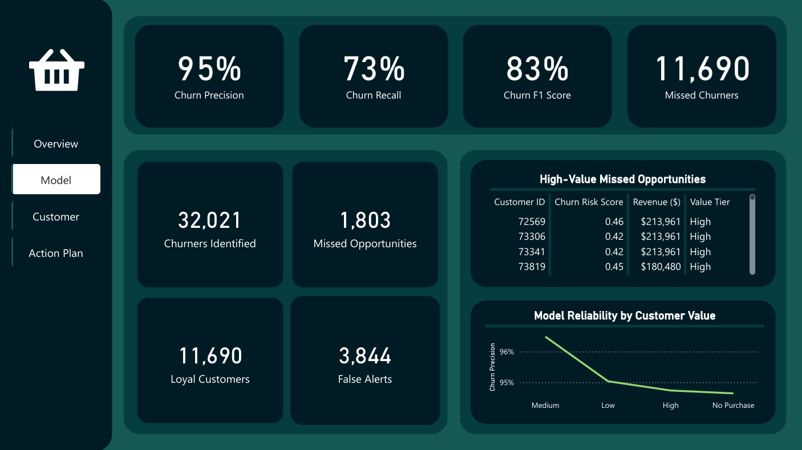
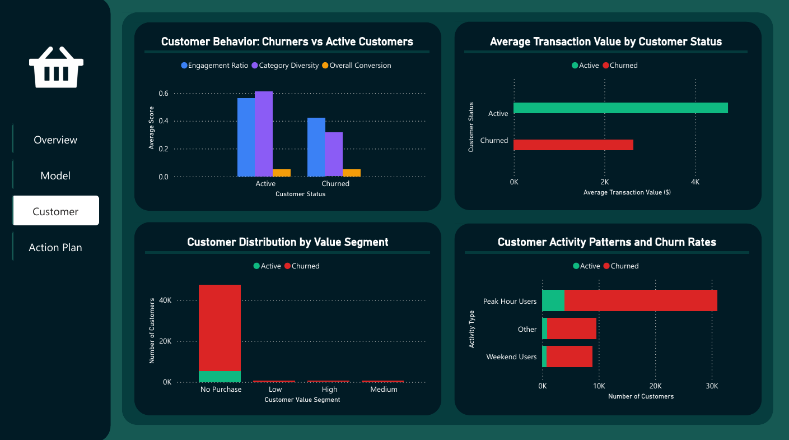

# Customer Retention Intelligence Dashboard

*Machine Learning-Powered Churn Prediction and Business Intelligence Platform*



## 🎯 Project Overview

A comprehensive end-to-end customer churn prediction system that combines advanced machine learning with executive-ready business intelligence. This solution identifies at-risk customers with 95% precision while providing actionable insights through an interactive 4-page Power BI dashboard.

### Key Achievements
- **49.4K** customers analyzed with behavioral pattern recognition
- **95%** model precision in churn detection 
- **$101.7M** revenue at risk identified and quantified
- **22.7K** actionable intervention opportunities discovered

## 🚀 Business Impact

- **Immediate Value**: Identified 631 critical customers requiring urgent retention within 48 hours
- **Strategic Insights**: Revealed low-engagement customers have 90% churn rates, directing UX priorities
- **Financial Impact**: Quantified at-risk revenue with prioritized intervention strategies
- **Operational Efficiency**: Automated customer risk assessment with data-driven recommendations

## 🛠️ Technology Stack

- **Machine Learning**: Python, Scikit-learn, Pandas, NumPy
- **Data Visualization**: Power BI, Matplotlib, Seaborn  
- **Feature Engineering**: Custom behavioral analytics functions
- **Business Intelligence**: DAX, Advanced Power BI formatting
- **Model Evaluation**: Classification metrics, SHAP analysis

## 📁 Project Structure

```
📦 ecommerce-churn-prediction-dashboard
├── 📁 dashboard/
│   ├── 📁 dashboard_screenshots/
│   │   ├── Overview.png
│   │   ├── Model.png
│   │   ├── Customer.png
│   │   └── Action Plan.png
│   ├── ecommerce_churn_dashboard.pdf
│   ├── ecommerce_churn_dashboard.pptx
│   └── ecommerce_churn_dashboard.pbix
├── 📁 data/
│   ├── 📁 exports/
│   │   ├── churn_predictions_powerbi.csv
│   │   └── feature_importance_top10.csv
│   ├── 📁 processed/
│   │   └── preprocessed_churn_data.csv
│   └── 📁 raw/
│       └── ecom-user-churn-data.csv
├── 📁 models/
│   ├── all_trained_models.pkl
│   ├── best_churn_model.pkl
│   ├── churn_model.pkl
│   ├── encoders.json
│   ├── encoders.pkl
│   ├── feature_importance.json
│   ├── feature_info.json
│   ├── model_metadata.json
│   └── scaler.pkl
├── 📁 notebooks/
│   ├── 01_data_exploration.ipynb
│   ├── 02_data_preprocessing.ipynb
│   ├── 03_churn_modeling.ipynb
│   ├── 04_model_evaluation.ipynb
│   ├── 05_business_insights.ipynb
│   └── 06_data_exports_powerbi.ipynb
├── .gitattributes
├── .gitignore
├── README.md
├── requirements.txt
└── shopping-basket-white-icon.png
```

## 🔍 Dashboard Components

### Page 1: Executive Summary

- **Key Metrics**: Customer count, churn rate, revenue at risk, model precision
- **Risk Distribution**: Customer segmentation by risk levels
- **Revenue Analysis**: Financial impact by customer value segments
- **Engagement Insights**: Churn patterns by customer engagement levels

### Page 2: Model Performance  

- **Performance Metrics**: 95% precision, 73% recall, 83% F1-score
- **Prediction Accuracy**: Confusion matrix with business-friendly labels
- **Model Reliability**: Precision analysis across customer value segments
- **Error Analysis**: High-value missed opportunities identification

### Page 3: Customer Insights

- **Behavioral Patterns**: Engagement and activity differences between churned vs active customers
- **Value Analysis**: Transaction patterns and customer segmentation
- **Activity Types**: Usage patterns and their correlation with churn
- **Revenue Impact**: Financial implications of different customer behaviors

### Page 4: Action Planning

- **Priority Customers**: Top 100 customers requiring immediate intervention
- **Risk Distribution**: Customer counts by risk levels with recommended actions
- **Success Metrics**: Winnable customers, high-value targets, critical cases
- **Action Plan**: Specific steps with timelines and success targets

## 🔬 Technical Implementation

### Data Processing & Feature Engineering
- **Behavioral Features**: Engagement ratios, recency scores, activity patterns
- **Statistical Features**: Session consistency, frequency variations, seasonal patterns  
- **Business Metrics**: Conversion rates, transaction values, category diversity
- **Risk Scoring**: Composite risk assessment combining multiple factors

### Machine Learning Pipeline
- **Data Preprocessing**: Robust scaling, encoding, and validation procedures
- **Model Training**: Optimized classification with comprehensive evaluation
- **Feature Importance**: SHAP analysis for model interpretability
- **Performance Validation**: Cross-validation with business-relevant metrics

### Dashboard Development
- **Dynamic Measures**: Real-time DAX calculations for business KPIs
- **Professional Design**: Consistent color scheme and executive-friendly layouts
- **Interactive Analytics**: Drill-down capabilities and responsive visualizations
- **Business Intelligence**: Automated insights and actionable recommendations

## 📊 Key Findings

### Model Performance
- **Precision**: 95% - When we predict churn, we're right 95% of the time
- **Recall**: 73% - We catch 73% of actual churners
- **Business Focus**: High precision minimizes wasted retention efforts

### Customer Insights
- **Engagement Impact**: Low-engagement customers show 90% churn rates
- **Value Correlation**: High-value customers have better retention patterns
- **Behavioral Patterns**: Session consistency is the strongest churn predictor
- **Risk Segmentation**: 19,410 customers require immediate/high-priority intervention

### Actionable Recommendations
1. **Immediate**: Contact 631 critical/high-value customers within 48 hours
2. **Short-term**: Launch retention campaigns for 22,723 winnable customers
3. **Long-term**: Address engagement issues and improve model accuracy
4. **Target**: Reduce churn from 89% to 75% in 90 days

## 🚀 Getting Started

### Prerequisites
```bash
Python 3.8+
Power BI Desktop
```

### Installation
```bash
# Clone the repository
git clone https://github.com/HanselLiebrata/ecommerce-churn-prediction-dashboard.git

# Navigate to project directory
cd ecommerce-churn-prediction-dashboard

# Install dependencies
pip install -r requirements.txt
```

### Running the Analysis
1. **Data Exploration**: Open `notebooks/01_data_exploration.ipynb`
2. **Data Preprocessing**: Run `notebooks/02_data_preprocessing.ipynb`
3. **Model Training**: Execute `notebooks/03_churn_modeling.ipynb`
4. **Model Evaluation**: Run `notebooks/04_model_evaluation.ipynb`
5. **Business Insights**: Analyze with `notebooks/05_business_insights.ipynb`
6. **Dashboard Prep**: Execute `notebooks/06_data_exports_powerbi.ipynb`
7. **View Dashboard**: Open `dashboard/ecommerce_churn_dashboard.pbix` in Power BI

## 📈 Results & Metrics

### Model Performance
| Metric | Value | Business Meaning |
|--------|-------|------------------|
| Precision | 95% | Reliable churn predictions |
| Recall | 73% | Catches most actual churners |
| F1-Score | 83% | Balanced overall performance |
| Customers Analyzed | 49,358 | Complete dataset coverage |

### Business Impact
| Insight | Value | Action Required |
|---------|-------|-----------------|
| Revenue at Risk | $101.7M | Immediate retention focus |
| Critical Cases | 501 customers | 24-hour outreach |
| High-Value Targets | 130 customers | Priority intervention |
| Winnable Customers | 22,723 customers | Campaign deployment |

## 📊 Dataset

**Original Dataset**: [User Churn Dataset](https://www.kaggle.com/datasets/fridrichmrtn/user-churn-dataset) from Kaggle

This synthetic e-commerce dataset contains customer interaction data with features including session frequency, transaction patterns, category interactions, and behavioral metrics across multiple customer segments.

## 🔄 Future Enhancements

- **Real-time Scoring**: Implement live churn probability updates
- **Advanced Segmentation**: Develop micro-segment specific models  
- **A/B Testing Framework**: Measure intervention effectiveness
- **Automated Alerts**: Trigger-based customer success workflows
- **External Data Integration**: Social media and economic indicators

## 📋 Requirements

```text
pandas>=1.5.0
numpy>=1.21.0
scikit-learn>=1.1.0
matplotlib>=3.5.0
seaborn>=0.11.0
shap>=0.41.0
jupyter>=1.0.0
```

---